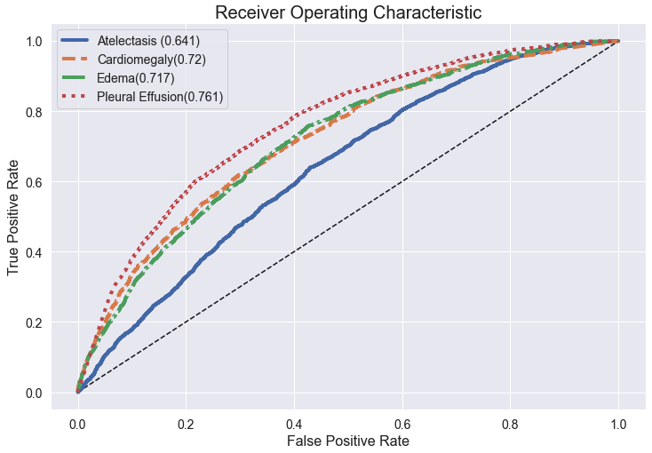

# Minimum Viable Product

#### A DEEP LEARNING CLASSIFIER FOR CHEST X-RAYS

Using raw data consisting of 224,316 chest X-rays of 65,240 patients performed between October 2002 and July 2017 in both inpatient and outpatient centers, deep learning classifiers are being developed to identify one or more of four possible diagnoses (Atelectasis, Cardiomegaly, Edema, Pleural Effusion) which might be indicated by a given X-ray. The modeling objective is to maximize Recall (meaning minimizing Type II errors or False Negatives at the expense of being willing to accept Type I errors or False Positives). The priority here lies with not allowing a nurse or general practitioner (the first people to see many X-rays) to miss a potentially positive diagnosis for any of the four conditions of interest. Any X-rays classified as being positive for any such conditions will be forwarded to a skilled radiology expert who can make the final determination.

The Area Under the Receiver Operating Curve (AUROC) plot shown below indicates the predictive performance observed with the latest model developed (comparing held-out Validation set data to Traning set data; Test set data has not yet been touched and will not be until final model selection). Note that the model has 4 separate and non-mututally-exclusive targets (the 4 diagnoses identified above), making this a multi-label classifier. Essentially, we are trying to use just one model to simultanously identify the possible presence of up to four different diagnoses:

Clearly, current performance (based on using a VGG16 model pre-trained on the ImageNet dataset followed by a several-layer trainable Convolutional Neural Network) is not particulary impressive, but further tuning experiments are underway (including using dropout between the trainable layers for regularization, allowing some of the last VGG16 layers to be trained, and substituting other pre-trained models such as DenseNet121 for VGG16). Moreover, experiments are underway to use a custom per-class-weighted loss function since all 4 of the diagnoses constitute imbalanced classification problems.

Finally, some philosophical debate is underway as to wheter or not one model that can well-classify all 4 of the medical conditions of interest is a necessary design goal. Four models, each of which specializes in just one of the 4 conditions, may make more sense since both approaches (running one over-arching model vs. running 4 independent models) can be applied in practice to a single incoming chest X-ray in a trivial amount of time. Therefore, individual classification models for each diagnosis are also under consideration.

